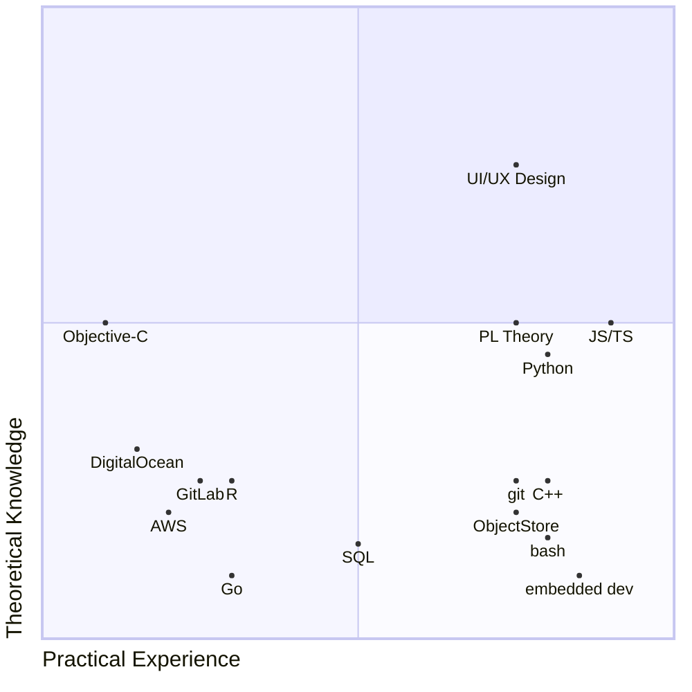
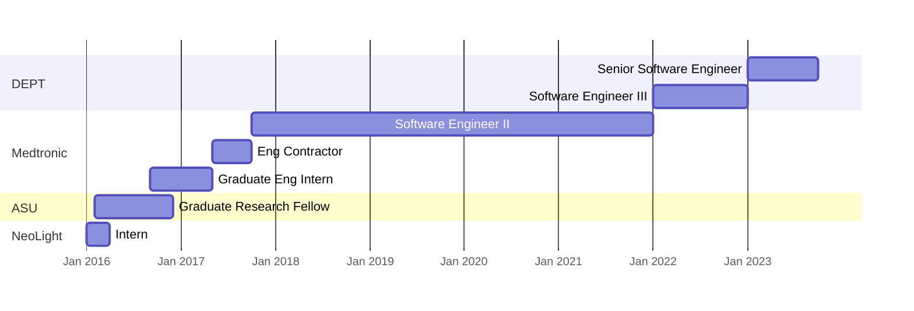

# Ashwin Sundar

| Senior Software Engineer | |  
| - | - |  
| (480) - 216 - 0436 | [ashwin.sundar@asu.edu](ashwin.sundar@asu.edu) |  

---

*introduction*

---

## Technical Skills
<!-- TO DO:
- color code by category (DevOps, Programming Languages, dev tools, etc)
-->

### Definitions

**Practical Experience**: Midpoint corresponds to 6 months of hands-on experience with skill

**Theoretical Knowledge**: Midpoint corresponds to 1 formal course in topic, or 1 informal course (e.g. via Coursera, with certificate)

**Caveat**: This is a rough assessment (+/- 25% on each axis for each skill)

## Work History

### DEPT

#### Title: Senior Software Engineer
#### Responsibilities: 

## Education  

### Arizona State University

M.S. Biomedical Engineering

### University of California, Los Angeles

B.S. Neuroscience