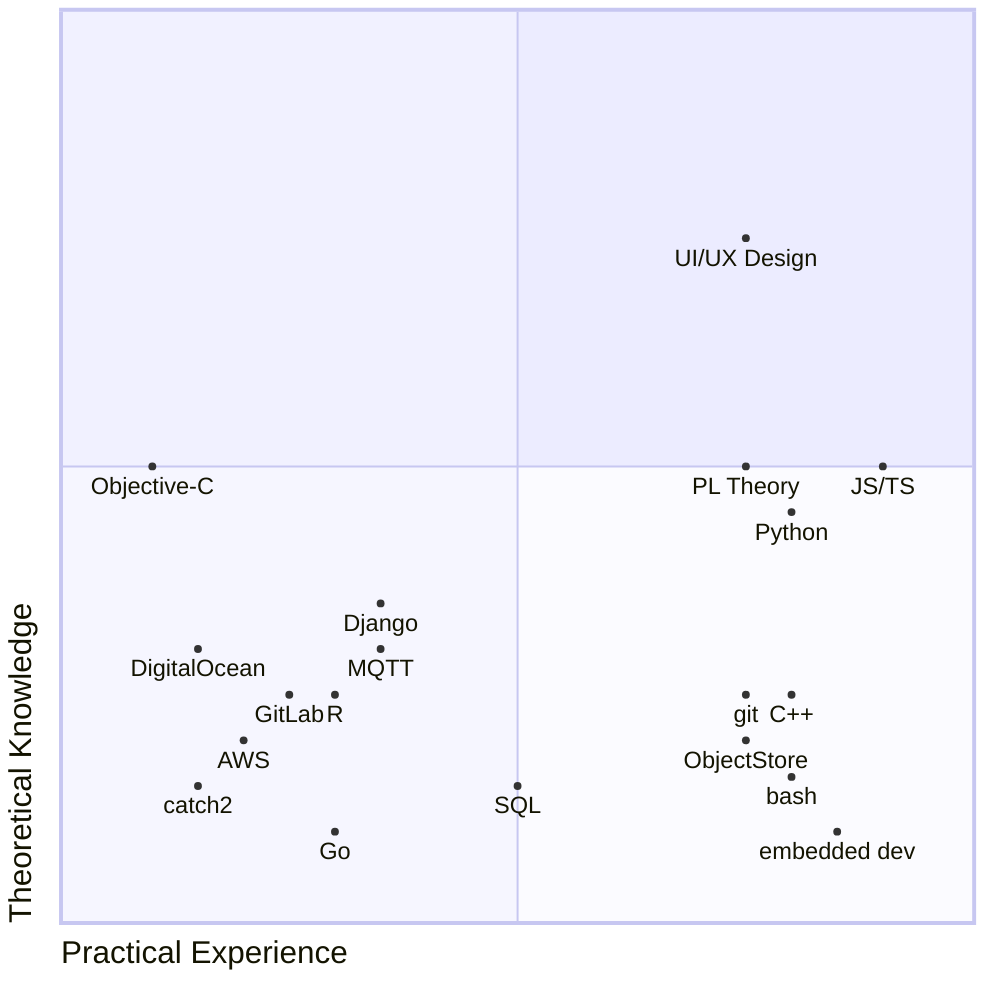
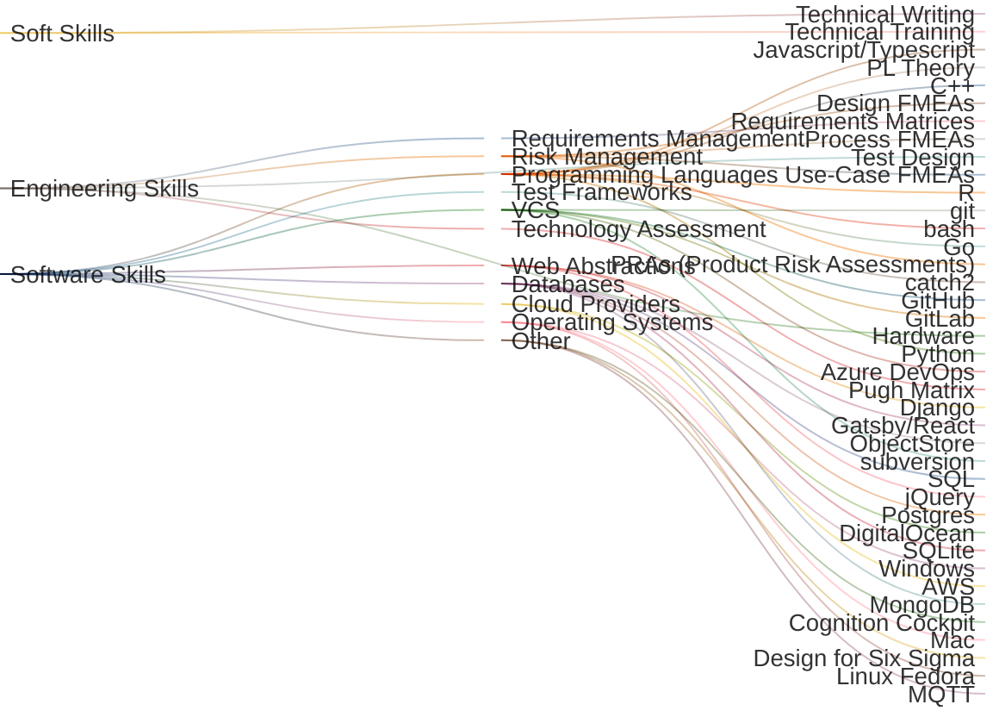
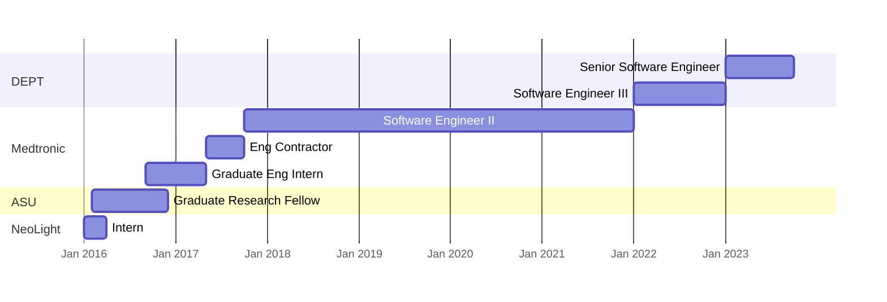

# Ashwin Sundar

| Senior Software Engineer | |  
| - | - |  
| (480) - 216 - 0436 | [ashwin.sundar@asu.edu](ashwin.sundar@asu.edu) |  

---

*introduction*

---

## Technical Skills
<!-- TO DO:
- color code by category (DevOps, Programming Languages, dev tools, etc)
-->

### Definitions

**Practical Experience**: Midpoint corresponds to 6 months of hands-on experience with skill

**Theoretical Knowledge**: Midpoint corresponds to 1 formal course in topic, or 1 informal course (e.g. via Coursera, with certificate)

**Caveat**: This is a rough assessment (+/- 25% on each axis for each skill)

## Work History

### DEPT (January 2022 - present) - Denver, CO

- Senior Software Engineer (January 2023 - present)
- Software Engineer III (January 2022 - January 2023)

#### Client: Communications Provider (August 2023 - present)

- Satellite communications integration
- **Tools Used**: Golang, AWS, Postgres, Docker, GitLab, git

#### Client: Medical Device Manufacturer (August 2022 - July 2023)

- Embedded Linux (C++)
- Mentorship of junior engineers
- **Tools used**: C++, gdb, catch2, shell scripting, Linux Fedora, GitHub, git

#### Client: Restaurant chain (January 2022 - August 2022)

- Full-stack web development for high-visibility business homepage
- **Tools used**: Gatsby/ReactJS, GraphQL, Azure DevOps, git

### Medtronic (October 2017 - January 2022) - multiple locations

- Software Engineer II (October 2017 - January 2022) - Denver, CO
  - Full-stack web solution for requirements and risk management
  - Developed/delivered software training to users in Colorado, Massachusetts, Florida, and Shanghai
  - Awarded 2018 Medtronic Beacon Award
  - Completed DRM Green Belt project, estimated business savings of $1.6 million per year
  - **Tools used**: Cognition Cockpit, Javascript/jQuery, HTML/CSS, ObjectStore, Tableau, SQL, R
- Software Requirements Engineer (May 2017 - October 2017) - Minneapolis, MN
  - Wrote software requirements describing heart monitoring system
- Graduate Engineering Intern (August 2016 - May 2017) - Phoenix, AZ
  - Implemented industrial statistics software tools, primarily around Design for Six Sigma
  - Awarded internal trade patent for healthcare analytics application
  - **Tools used**: SQL, Tableau, R, Cognition Cockpit, Javascript/jQuery, HTML/CSS

## Education  

### B.S. Neuroscience - University of California, Los Angeles

### M.S. Biomedical Engineering - Arizona State University

- [IDENTIFICATION OF CARDIAC ARRHYTHMIAS IN ELECTROCARDIOGRAPHY DATA USING EMPIRICAL MODE DECOMPOSITION](https://ashwinsundar.com/blog/ASU-MS-Applied-Project.pdf)
  - **Advisors:** Dr. Jeff LaBelle, Dr. Mark Spano, Dr. Heather Ross
  - **Abstract:** Electrocardiography (ECG) data is often subject to frequency domain techniques, such as Fourier and wavelet analysis, in order to deconstruct and understand the relationship between cardiac disease and electrical activity in the heart. However, ECG artifacts are typically brief, making frequency domain analysis challenging. An alternate method of analysis, empirical mode decomposition (EMD), may be more appropriate for analyzing short windows of data, since data analysis never leaves the time domain. EMD was applied to more than 2,000 ECG waveforms spanning a range of subjects and arrhythmia types from the MIT-BIH Arrhythmia Database. Physician annotations were used to window and sort waveforms, and EMD was used to deconstruct waveforms into intrinsic mode functions (IMF). An average IMF for each arrhythmia and the healthy ECG waveform was calculated. IMFs from each arrhythmia were then compared with IMFs from healthy ECG data. This comparison can be thought to represent a unique signature of each arrhythmia type.Electrocardiography

## Independent Study

- [Programming Languages Specialization](https://www.coursera.org/learn/programming-languages) (In Progress, Coursera/U Wash)
- [Accelerated Computer Science Fundamentals Specialization](https://www.coursera.org/account/accomplishments/specialization/QWNCL53BMER8?utm_source=link&utm_medium=certificate&utm_content=cert_image&utm_campaign=sharing_cta&utm_product=s12n) (Coursera/UIUC)
- [Ultimate Rust 2 - Intermediate Concepts](https://www.udemy.com/certificate/UC-5c5cc621-0ac8-44ae-8915-792c8ee0add0/) (Udemy)
- Rust Fundamentals (Pluralsight)
- [HTML, CSS, and Javascript for Web Developers](https://coursera.org/share/e84a063b6b4cd55564b47b5cc88c9100) (Coursera)
- [Introduction to UI Design](https://coursera.org/share/0e0eec27afa51fbf2ba6e48852a65c4f) (Coursera)
- Circuits and Electronics I: Basic Circuit Analysis (MIT OpenCourseware)
- Discrete Mathematical Structures (Mesa Community College, Grade: A)
- Calculus III (Mesa Community College, Grade: A)
- Linear Algebra (Mesa Community College, Grade: A)
- Differential Equations (Mesa Community College, Grade: A)

## Awards and Certifications

- 2018 Medtronic Beacon Award
- DRM/DFSS Green Belt (Medtronic, 2018)
- 2017 Medtronic Internal Patent #A000****
- 1st place, Mesa Community College Math Contest (2014)
